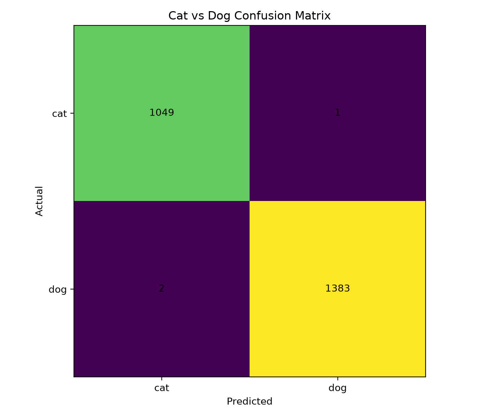

# 🐱🐶 Cat vs Dog Image Classifier

A deep learning based image classification project that identifies whether an uploaded image contains a **cat** or a **dog** using **EfficientNet-B0** and PyTorch.

Built as a **team machine learning project** with a complete training, evaluation, prediction, and dataset quality pipeline.

---

## 📌 Project Overview

The goal of this project is to build a reliable image classifier capable of distinguishing cats and dogs from images.

The project includes the complete ML workflow:

- Dataset preparation
- Dataset inspection
- Duplicate detection
- Data leakage prevention
- Model training using EfficientNet-B0
- Model evaluation
- Image prediction on unseen images

Rather than only training a model, this project also focuses on validating dataset quality before evaluating performance.

---

## ✨ Features

- Binary image classification for Cats and Dogs
- EfficientNet-B0 transfer learning architecture
- GPU training with CUDA support
- Dataset preparation scripts
- Exact duplicate detection across dataset splits
- Near-duplicate inspection utilities
- Automatic duplicate cleanup
- Model evaluation with multiple metrics
- Confusion matrix generation
- Prediction script for custom images
- Data augmentation for improved generalization
- Regularization using dropout and label smoothing

---

## 🧠 Model Architecture

The classifier uses **EfficientNet-B0** implemented with PyTorch.

### Configuration

- Framework: PyTorch
- Architecture: EfficientNet-B0
- Image Size: 224 × 224
- Classes: Cat, Dog
- Optimizer: AdamW
- Loss Function: Cross-Entropy Loss with label smoothing
- Dropout: 0.3
- CUDA GPU acceleration supported

The training pipeline also uses data augmentation techniques such as random cropping, horizontal flipping, rotation, color jitter, and affine transformations to improve robustness to variations in real-world images.

---

## 📂 Dataset

The dataset contains images of cats and dogs collected from public Kaggle datasets.

After preparation and cleaning, the final dataset contained:

| Split      |     Images |
| ---------- | ---------: |
| Training   |     11,318 |
| Validation |      2,434 |
| Testing    |      2,435 |
| **Total**  | **16,187** |

The dataset is intentionally **not included** in this repository because of its size.

---

## 🔍 Dataset Cleaning & Leakage Prevention

One of the major parts of this project was validating the dataset before trusting the model's accuracy.

The workflow included:

1. Inspecting dataset structure
2. Creating clean train, validation and test splits
3. Detecting exact duplicate images using SHA-256 hashing
4. Detecting perceptually similar images using perceptual hashing
5. Removing confirmed duplicate training samples
6. Re-training the model on the cleaned dataset
7. Performing final evaluation on the held-out test set

Final verification confirmed:

- **0 exact cross-split duplicate groups**
- Validation and test sets remained untouched during cleanup

This helped produce a more trustworthy evaluation pipeline.

---

## 📊 Final Results

The final model was evaluated on **2,435 unseen test images**.

| Metric    |                                              Score |
| --------- | -------------------------------------------------: |
| Accuracy  |                                         **99.55%** |
| Precision | **Not recalculated after the latest training run** |
| Recall    | **Not recalculated after the latest training run** |
| F1 Score  | **Not recalculated after the latest training run** |

The latest training run achieved:

- Best validation accuracy: **99.92%**
- Final test accuracy: **99.55%**

The previous evaluation metrics shown below belong to the earlier model version and should not be presented as the results of the latest model.

### Previous Model Evaluation

For reference, the previous model achieved:

| Metric    |      Score |
| --------- | ---------: |
| Accuracy  | **99.88%** |
| Precision | **99.93%** |
| Recall    | **99.86%** |
| F1 Score  | **99.89%** |

Previous confusion matrix:



| Actual / Predicted |  Cat |  Dog |
| ------------------ | ---: | ---: |
| Cat                | 1049 |    1 |
| Dog                |    2 | 1383 |

These metrics correspond to the previous training configuration.

---

## 🌎 Generalization Testing

The updated training pipeline was tested on external dog images that had previously exposed generalization problems.

| Image            | Result           |
| ---------------- | ---------------- |
| `test_dog4.jpeg` | **DOG - 92.52%** |
| `test_dog25.jpg` | **DOG - 83.05%** |

The same model was also tested using additional blurred and varied images during local testing.

These tests demonstrated improved behavior on images outside the original held-out dataset.

---

## 📁 Project Structure

```text
Cat-Dog-Classifier/
│
├── src/
│   ├── prepare_dataset.py
│   ├── inspect_dataset.py
│   ├── create_clean_dataset.py
│   ├── check_duplicates.py
│   ├── inspect_near_duplicates.py
│   ├── remove_exact_near_duplicates.py
│   ├── train.py
│   ├── evaluate.py
│   └── predict.py
│
├── models/
│   └── class_names.json
│
├── results/
│   └── confusion_matrix.png
│
├── .gitignore
└── README.md
```
